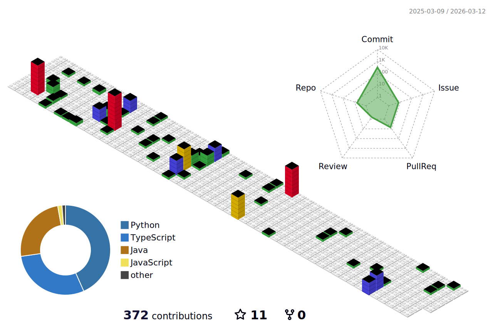

## ✨ GitHub Stats

	

 

<!-- START_CUSTOM_SECTION -->
## 📕 Latest Blog Posts

- [SonarQube와 JaCoCo로 테스트 커버리지 측정하기](https://dev-rowing.tistory.com/41)
- [SonarQube와 GitHub Actions로 정적 코드 품질 관리하기](https://dev-rowing.tistory.com/40)
- [[프로그래머스] Lv. 2 문자열 압축(Java)](https://dev-rowing.tistory.com/39)
- [[프로그래머스] Lv. 1 삼진법 뒤집기(Java)](https://dev-rowing.tistory.com/38)
- [Testcontainers를 활용한 AWS S3 테스트 환경 구성하기](https://dev-rowing.tistory.com/37)
- [Spring Boot와 LocalStack으로 AWS S3 테스트 환경 구성하기](https://dev-rowing.tistory.com/36)
- [테스트 컨테이너(Testcontainers) 알아보기](https://dev-rowing.tistory.com/35)

<!-- END_CUSTOM_SECTION -->

 

## 🏃 Weekly Challenge

 

## 📈 Contribution Analysis

