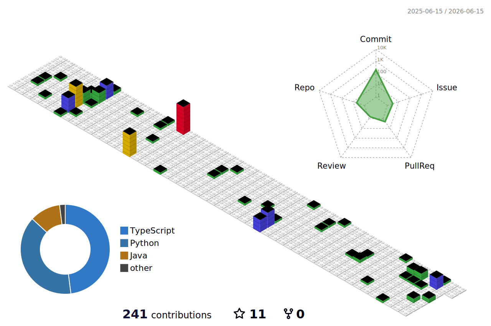

<h2 align="center">✨ 기획부터 운영까지, 병목을 줄이는 백엔드 개발자</h2>

<p align="center">
  제약 속에서 현실적인 시스템을 설계하고,<br/>
  성능 · 비용 · 운영 효율을 데이터 기반으로 개선하는 데 집중합니다.
</p>

<p align="center">
  <a href="https://dev-rowing.tistory.com/">
    
  </a>
  <a href="https://github.com/rowing0328">
    
  </a>
</p>

## 🛠 Tech Stack

<p>
  
  
  
  
  
  
  
  
  <br/>
  
  
  
  
  
  
  
</p>

## 🧭 Working Style

```text
문제 정의 → 병목 측정 → 작은 단위 개선 → 테스트/로그 검증 → 운영 가능한 구조로 정리
```

<!-- START_CUSTOM_SECTION -->
## 📕 Latest Blog Posts

<table style="border: none; border-collapse: collapse;">
<tr style='border: none;'>
<td width="25%" align="center" style="border: none; padding: 0 4px;"><a href="https://dev-rowing.tistory.com/84"><br/><strong>Go 기초부터 HTTP CRUD API까지</strong><br/><sub>2026.05.18</sub></a></td>
<td width="25%" align="center" style="border: none; padding: 0 4px;"><a href="https://dev-rowing.tistory.com/83"><br/><strong>Mac에서 LitmusChaos 설치하기</strong><br/><sub>2026.05.10</sub></a></td>
<td width="25%" align="center" style="border: none; padding: 0 4px;"><a href="https://dev-rowing.tistory.com/82"><br/><strong>[Go] 왜 Go를 배워야 할까</strong><br/><sub>2026.05.09</sub></a></td>
<td width="25%" align="center" style="border: none; padding: 0 4px;"><a href="https://dev-rowing.tistory.com/80"><br/><strong>Ubuntu 22.04 vs 24.04 어떤 버전을 도입해야 할까?</strong><br/><sub>2025.08.06</sub></a></td>
</tr>
</table>
<!-- END_CUSTOM_SECTION -->

## 📈 Contribution Analysis
<div align="center">
  
</div>
